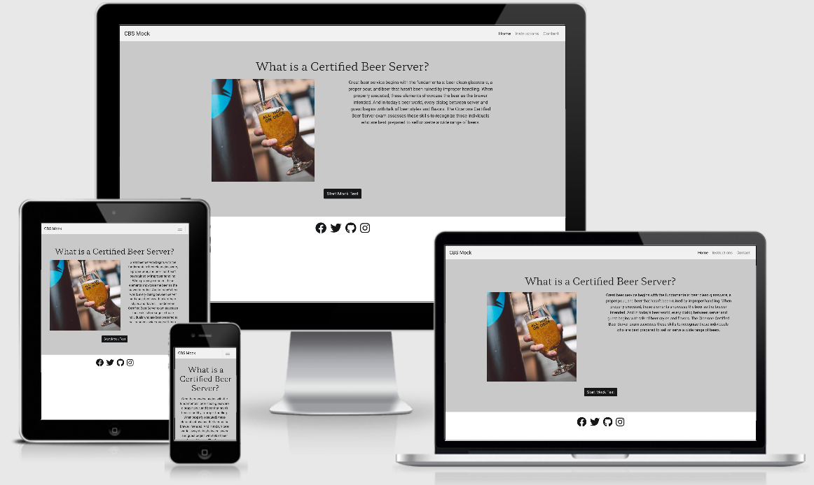
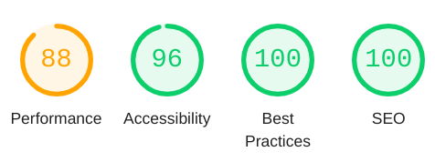
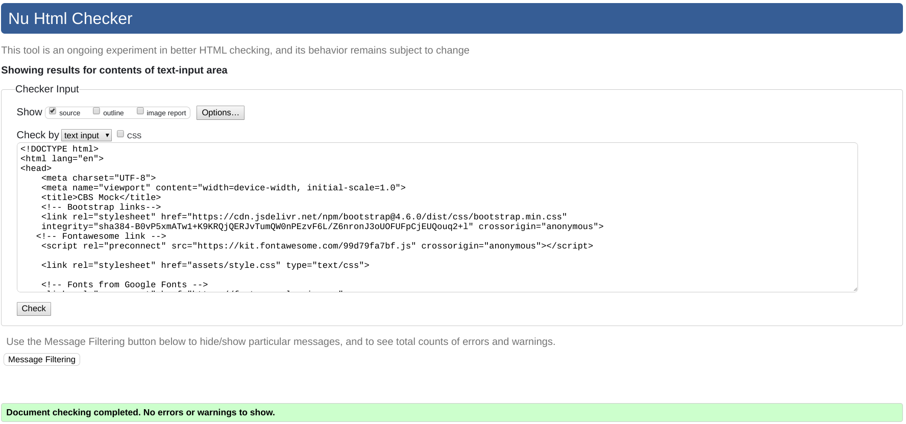
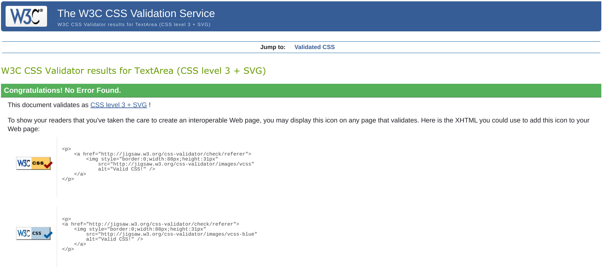

# Milestone Project Two /  Mock Certified Beer Server Exam

[View the live project here](https://matthewelstone.github.io/MockCBS/)

This website was created for my Milestone Two Interactive Frontend Development Project. I wanted to make a mock exam site for the Cicerone Certified Beer Server exam. The user will have half an hour to answer sixty randomised multiple choice questions with a passing mark of 45/60 just as in the actual exam. 

## Contents

- [User Expreience](#user-experience)

  - [User Stories](#user-stories)
  - [Owner Goals](#owner-goals)
  - [Design](#design)

- [Features](#features)
   
  - [Current Features](#current-features)
  - [Features which I want to implement in the future](#Features-which-I-want-to-implement-in-the-future)

- [Technologies Used](#technologies-used)

- [Testing](#testing)
  - [User Stories](#user-stories) 
  - [Owner Goals](#owner-goals)
  - [Lighthouse Testing](#lighthouse-testing)
  - [HTML and CSS Testing](#html-and-css-testing)
  - [Known Bugs](#known-bugs)

- [Deployment](#deployment)

- [Credits](credits)

## User Experience 

### User Stories

- **First Time Visitor Goals**

 1. As a first time visitor, I want to easily understand the main purpose of the site.
 2. As a first time visitor, I want to be able to easily navigate through the site.
 3. As a first time visitor, I expect the site to be responsive so that I can view it on any device. 
 4. As a first time visitor, I want to be able to understand how the test works. 
 5. As a first time visitor, I want the site to be visually appealing.

- **Returning/ Frequent Visitor Goals.**

 1. As a returning visitor, I want to be able to contact the owner with any comments or questions that I might have.
 2. As a returning visitor, I want to be able to access any social media links so that i can follow them on my chosen platform.
 3. As a returning visitor, I want to be provided with a varied order of questions each time that I take the exam. 

### Owner Goals
 1. I want the site to work as intended incrementing the questions and score.
 2. I want the user to have a different order of questions each time that they take the exam.
 3. I want the user to be able to navigate easily through the different pages of the site.
 4. I want the site to be attractive, responsive and easy to use. 
 5. I want the users to easily be able to contact the site owner.

### Design

I wanted the design of the website to fit in with the Cicerone websites very clean look and to compliment this. 
I wanted the design to be very minimal with very few pictures or other features to distract away from the test. 
I wanted to continue these minimal theme across the site so I kept the same colour scheme across the different pages. 

- ### Colour scheme

I chose a very minimal colour scheme for this project as I didn't want anything to be taking away or distracting the user from the actual exam. I then chose standard green and red colours as they are widely associated with correct and incorrect answers. 

- ### Typography

The two fonts I have used for this project are Hahmlet and Roboto both imported from Google fonts. 
The Hahmlet font has been used for the header elements and for the instructions. I paired this with the complimentary font of Roboto for all of the other text.
 
- ### Wireframes

I made all of my wireframes using Balsamiq. Making one for each page showing how the page would change for each screen size. 

- Index 
[Mobile](assets/images/readmeimages/phone-index.png)
[Tablet](assets/images/readmeimages/tablet-index.png)
[Web](assets/images/readmeimages/web-index.png)

- Instructions 
[Mobile](assets/images/readmeimages/instructions-phone.png)
[Tablet](assets/images/readmeimages/instructions-tablet.png)
[Web](assets/images/readmeimages/instructions-web.png)

- Contact
[Mobile](assets/images/readmeimages/phone-contact.png)
[Tablet](assets/images/readmeimages/tablet-contact.png)
[Web](assets/images/readmeimages/web-contact.png)

- Result
[Mobile](assets/images/readmeimages/phone-results.png)
[Tablet](assets/images/readmeimages/tablet-results.png)
[Web](assets/images/readmeimages/web-results.png)

The design of the project was kept very similar to the wireframes.  There wasn't a huge amount of change that I wanted to introduce between the different screen sizes apart from adding in an image to the index.html on larger screen sizes. Initially I had thought about on larger devices having two questions stacked together side by side however I decided against this as I thought that it may have made the answers look too crammed together in the longer options.

## Features
### Current Features
- Responsive to different device sizes.
- Social media links that open up in a seperate tab and will take the user to the home page of the selected link.
- A pop up modal when the user clicks on the instructions.
- A pop up modal when confirming that the email has sent when someone sends an email through the contact page.
- A start button which starts the exam.
- A question counter that displays what number question the user is on out of 60.
- A timer that displays how long the user has left of the 30 minute time limit.
- Questions that are shuffled each time the exam is taken.
-A question with four possible answers.  When an answer is selected the answer will turn green if correct, red if incorrect and the correct answer will show green.
- A next button that displays once you choose an answer.
- A results table that displays once you have either answered all of the questions or the time limit has been reached.
- The table will display a message congratulating you for passing and turning green or saying to study more for not passing and turning red.
- The table displays correct answers, wrong answers, and percentage correct. 
- A contact page that sends an email directly to the site owner.

### Features which I want to implement in the future
- A larger bank of questions to pull from.
- A seperate test to take first about the Cicerone program.
- Links to learning materials 
- A list of questions that the user answered incorrectly at the end of the exam.
- A leader board with answers correct and the time that they took to complete the exam

## Technologies Used

## Languages Used
1. [HTML5](https://en.wikipedia.org/wiki/HTML5)
2. [CSS3](https://en.wikipedia.org/wiki/CSS)
3. [JS](https://en.wikipedia.org/wiki/JavaScript)

## Frameworks, Libraries, Programs Used
1. [Bootstrap v4.6.0](https://getbootstrap.com/)

Bootstrap was used for the responsive layout of the site and the initial styling.

2. [Google Fonts](https://fonts.google.com/)

Google fonts ws used throughout the site to import the Hahmlet and Roboto fonts.

3. [Git](https://git-scm.com/)

Git was used as a version control software

4. [GitHub](https://github.com/)

GitHub was used as a remote repository where I pushed commits to. 
GitHub was also used to deploy the site throuhg GitHub pages.

5. [GitPod](https://www.gitpod.io/)

GitPod was used as a text editor that I used to write some of my HTML, CSS and JavaScript.  I stopped using this after the first few days of the project as I can't seem to get along with it. 

6. [Visual Studio Code](https://code.visualstudio.com/)

Visual Studio Code was the text editor that I used to write the majority of mt HTML, CSS and Javascript in.

7. [Font Awesome](https://fontawesome.com/)

Was used for the logos of the social media links through the site.

8. [Balsamiq](https://balsamiq.com/)

I used Balsamiq to designa and draw my wireframes before coding the project.

9. [TinyPNG](https://tinypng.com/)

Tiny PNG was used to compress the image down to a smaller size so that the webpages could load faster. 

10. [Chrome Devtools](https://developer.chrome.com/docs/devtools/)

Chrome Devtools was used throughout the process helping style the site and help fix any bugs which I found.

11. [Am I Responsive](http://ami.responsivedesign.is/)
Was used for the the Image at the top of the repository.

12. [EmailJS](https://www.emailjs.com/) 
Was used to handle the email services from the contacts page.

13. [jQuery](https://jquery.com/)
Was used as a JavaScript library to speed up the writing of JavaScript.

## Testing 

### Testing User Stories and Site Goals

### First Time Visitor Goals

**As a first time visitor, I want to easily understand the main purpose of the site.**
The first thing that you are faced with on the home page is a short paragraph taken from the Cicerone website where they quickly explain what the certification is about.

**As a first time visitor, I want to be able to easily navigate through the site.**
From the home page the user has just one button to click on the page to start the mock test once they click this they continue through the test which is all very self explanitory.  At the end of the test they are presented with a Home button which refreshes the page and takes them back to index.html.
There is also a navbar at the top of the page throughout which is very easy to navigate through.

**As a first time visitor, I expect the site to be responsive so that I can view it on any device.**
By keeping the layout of the design very simple and similar across all devices it easily adapts to the screen size which is displayed on. 
This has been tested across a variety of phones tablets and desktops.

**As a first time visitor, I want to be able to understand how the test works.** 
There is a instructions link in the nav bar which is always displayed at the top of the page. This brings up a modal which clearly and precisely explains the test.

**As a first time visitor, I want the site to be visually appealing.**
I have asked colleagues, family members and members of the slack community for their honest feedback on the design and layout of the test.  It has recieved possitive reviews from the minimalistic layout and subtle colour scheme.

### Returning/ Frequent Visitor Goals

**As a returning visitor, I want to be able to contact the owner with any comments or questions that I might have.**
There is a contact page that will send an email straight to the page owner. The email will not send if all of the required field are not filled in and then a modal will pop up telling you that the email has been sent.

**As a returning visitor, I want to be able to access any social media links so that i can follow them on my chosen platform.**
These are found at the bottom of each page and will open each social media page in its own tab.

**As a returning visitor, I want to be provided with a varied order of questions each time that I take the exam.**
The questions are randomised each time using a Math.random function so that each test will be slightly different. 

### Owner Goals

**I want the site to work as intended incrementing the questions and score.**
With each answer chosen either the correctAnswers or wrongAnswers variable will be incremented so that at the end of the exam they can be displayed.

**I want the user to have a different order of questions each time that they take the exam.**
The questions are randomised each time using a Math.random function so that each test will be slightly different. 

**I want the user to be able to navigate easily through the different pages of the site.**
From the home page the user has just one button to click on the page to start the mock test once they click this they continue through the test which is all very self explanitory.  At the end of the test they are presented with a Home button which refreshes the page and takes them back to index.html.
There is also a navbar at the top of the page throughout which is very easy to navigate through.

**I want the site to be attractive, responsive and easy to use.**
 I have asked colleagues, family members and members of the slack community for their honest feedback on the design and layout of the test.  It has recieved possitive reviews from the minimalistic layout and subtle colour scheme.

**I want the users to easily be able to contact the site owner.**
There is a contact page that will send an email straight to the page owner. The email will not send if all of the required field are not filled in and then a modal will pop up telling you that the email has been sent.

### Lighthouse Testing

My page didn't have a meta description which brought my search emgine optimisarion down so I added that in to boost the search engine optimisation.
All of the other fields were already pretty high.

### HTML and CSS Testing
To test my HTML I used the [W3C HTML Validation Service](https://validator.w3.org/)

The site came back with a warning that I had an empty heading. This heading was to be filled by the java script but I filled it with some placeholder text.
I also had a button which was a sibling of an anchor tag.  I fixed this by changing the button into a span.

To test my CSS I used the [W3C CSS Validation Service](https://jigsaw.w3.org/css-validator/)
The code came back with no errors.

### Known Bugs

### Deployment

- Creation 

I first created this repository by doing the following.

1. Logging into GitHub and clicking the green New button in the top right corner of the screen.
2. I then created a new repository using the Code Institute-Org/gitpod-full-template and used the repository name MockCBS I then clicked create repository.
3.I had the Gitpod chrome plugin downloaded so I clicked the green Gitpod button on the repository where I could start to write code for the site.

### Github Pages

I deployed the site by using GitHub Pages by doing the following.

1. Logging into GitHub and opening the MockCBS repository.
2. Opening settings on the right hand of the screen. 
3. Selecting the Pages tab on the bottom left side of the screen.
4. Choosing the Master branch and Root folder.
5. After a few minutes my site was published at https://matthewelstone.github.io/MockCBS 

### Forking the Repository

To fork the repository to contribute to the project you can do the following.
1. Log in to GitHub and open the MockCBS repository.
2. At the top right hand side of the page underneath your profile there is a fork symbol.
3. Once you have clicked this the repository will be forked.

### Cloning the Repository

If you wish to clone the repository you can do the following.
1. Go to [My account](https://github.com/matthewelstone) and sellect the MockCBS repository.
2. Next to the GitPod button (if you have GitPod installed) or in the top right click the code button.
3. Click download zip.
4. You can then open the repository with your chosen code editor.

### Credits

- [Bootstrap](https://getbootstrap.com/) was used throughout the site to help style the pages and to make the site responsive.
- [W3 Schools](https://www.w3schools.com/) For their modal template.
- [Falak 786 on CodePen](https://codepen.io/falak786/pen/oddYYd)For their 30 minute count down which I addapted from.
- [BrewDog](https://www.brewdog.com/uk/?gclid=CjwKCAjw3_KIBhA2EiwAaAAlioGxBrGIhDH9ouid_3I9pS5UWnb7BOlGym90yEhnzSdGnTUulFaG3BoCJ74QAvD_BwE) for use of their image and quiz questions taken from their training materials.
- [FontAwesome](https://fontawesome.com/) for the use of their fonts for the social media icons.
- [GoogleFonts](https://fonts.google.com/) for the ise of the fonts for the website.
- [EmailJS](https://www.emailjs.com/) for use of their email services for the contact page.
- [Cicerone Certification Program](https://www.cicerone.org/us-en) Is the certification board that the mock site is made to be a test for.

### Achnowledgements
- Code Institute.
- My colleagues at BrewDog checking the quiz questions.
- Mini Feb team 2021 For help with feedback through the last few months.